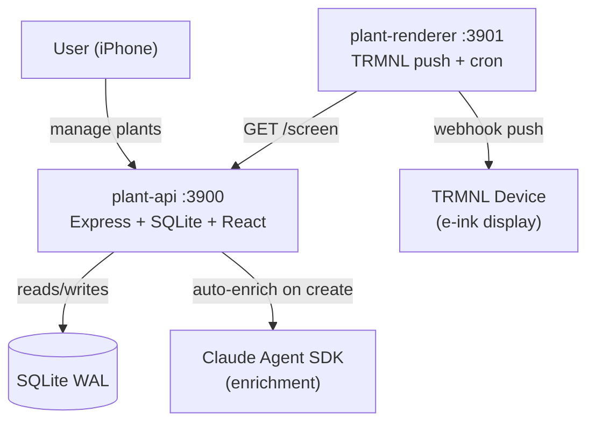

# Plant TRMNL

Plant care management with a TRMNL e-ink display and a mobile-first web app.

## Overview

Plant TRMNL combines a self-calibrating watering scheduler with an e-ink daily digest and a mobile web app for quick check-ins. It tracks plant conditions, rotates botanical facts, and handles vacation mode with smart rescheduling. Plant care data is auto-populated on creation via the Claude Agent SDK — species, base watering interval, light preference, and placement all come back without manual lookup.

Two Docker containers serve the app: `plant-api` (REST + SQLite + client) and `plant-renderer` (TRMNL template push).

## Architecture



The renderer has no direct database access — it only talks to the API over the internal Docker network.

## Features

- **Self-calibrating watering schedules** — learns from daily check-ins; adjusts frequency up or down based on observation history
- **Claude-driven enrichment** — auto-populates species, care profile, watering cadence, and placement on plant creation
- **Plant fact rotation** — 150+ curated botanical facts served in non-repeating order
- **Condition tracking** — observation-driven detection (overwatering, underwatering, rootbound, pests, light stress)
- **Vacation mode** — pauses schedules and reschedules intelligently on return
- **Feedback system** — floating action button on every page; capture bugs, ideas, and notes with a comment thread per item
- **Mobile-first management UI** — optimised for iPhone 15 Pro; single-handed watering log in two taps

## Tech Stack

| Layer | Technology |
|---|---|
| Runtime | Node.js 22+ + TypeScript |
| API | Express 5, better-sqlite3 (WAL mode) |
| Frontend | React 19 + Vite (served from `packages/api/client/`) |
| Infra | Docker Compose (OrbStack recommended) |
| Display | TRMNL webhook API (Developer Edition) |
| Enrichment | `@anthropic-ai/claude-agent-sdk` (runs against Claude Max) |

## Prerequisites

- Node.js 22+
- Docker + Docker Compose ([OrbStack](https://orbstack.dev) recommended on macOS)
- A [TRMNL](https://usetrmnl.com) device with Developer Edition enabled
- A Claude account (the Agent SDK uses your logged-in Claude Max subscription — no API key required)

## Quick Start

```bash
git clone <repo-url>
cd plant-trmnl
cp .env.example .env
# Edit .env — set TRMNL_API_KEY and TRMNL_PLUGIN_UUID
docker compose up --build -d
```

- Web app: http://localhost:3900
- TRMNL preview: http://localhost:3901/preview

## Development

```bash
npm install

# API server on :3900 (also serves the built React client)
npm run dev:api

# Renderer server on :3901
npm run dev:renderer

# React dev server (hot reload) on :5173 — proxies to the API
cd packages/api/client && npm run dev

# Tests
npm test               # All packages (244 API + 41 renderer)
npm run test:api       # API only
npm run test:renderer  # Renderer only
```

Tests use [vitest](https://vitest.dev). TDD is the default workflow — tests are written before implementation.

The Claude Agent SDK refuses to initialise if it detects it's running inside another Claude Code session. When developing from within Claude Code, prefix long-lived processes with `env -u CLAUDECODE` (e.g. `env -u CLAUDECODE npx tsx packages/api/src/index.ts`).

## TRMNL Device Setup

Point your TRMNL Developer Edition plugin at this renderer. The renderer pushes a data payload + Liquid template to the TRMNL webhook on its cron (`RENDER_CRON`, default `0 5 * * *`). The Liquid template lives at `docs/trmnl-templates/full-view.liquid` and must be pasted into the TRMNL plugin's **Edit Markup → Full** tab — it is not auto-deployed. Full setup details are in [`docs/specs/2026-04-07-plant-trmnl-design.md`](docs/specs/2026-04-07-plant-trmnl-design.md).

## Project Structure

```
plant-trmnl/
├── packages/
│   ├── api/                  # Express API + SQLite + business logic
│   │   ├── src/
│   │   │   ├── database/     # Schema, migrations, seeds
│   │   │   ├── routes/       # REST endpoints (plants, calibration, screen, feedback, ...)
│   │   │   ├── scheduling/   # Watering engine, calibration, vacation logic
│   │   │   ├── enrichment/   # Claude Agent SDK enrichment
│   │   │   ├── config.ts
│   │   │   └── index.ts
│   │   └── client/           # React 19 + Vite web app (built into dist/client)
│   └── renderer/             # TRMNL renderer + push cron
│       └── src/
│           ├── render/       # React screen component, cache, push
│           ├── cron.ts       # Scheduled render + TRMNL push
│           └── index.ts
├── docs/
│   ├── specs/                # Design specifications
│   ├── plans/                # Implementation plans
│   ├── mockups/              # Screen design references (4 PNG mockups)
│   └── trmnl-templates/      # Liquid templates (manually pasted into TRMNL UI)
├── assets/                   # Plant illustrations + seed facts (served read-only)
├── .agents/                  # GOTCHA framework agent configs
├── .env.example
├── docker-compose.yml
└── package.json              # npm workspaces root
```

## Screen Designs

Four TRMNL screen mockups live in [`docs/mockups/`](docs/mockups/):

| File | Description |
|---|---|
| `watering-1-plant.png` | Single plant due today |
| `watering-2-plants.png` | Multiple plants due today |
| `rest-day.png` | No plants due — rest day view |
| `rest-day-overdue.png` | Rest day with an overdue plant flagged |

## Frameworks

This project follows the frameworks Emiel uses across all projects:

- **GOTCHA** — 6-layer agentic architecture (`.agents/`)
- **ATLAS** — Architect-Trace-Link-Assemble-Stress-test (used during planning)
- **GROOM** — Gather-Review-Overlay-Opine-Make changes (used during iteration)
- **FINE** — Fail gracefully, Inform, Never crash silently, Expect the unexpected (error handling)
- **ORBIT** — Observe-Rig-Build-Instrument-Test (SRE/operational practices)
- **12-Factor App** — Config via env, stateless processes, explicit dependencies

## License

Private.
