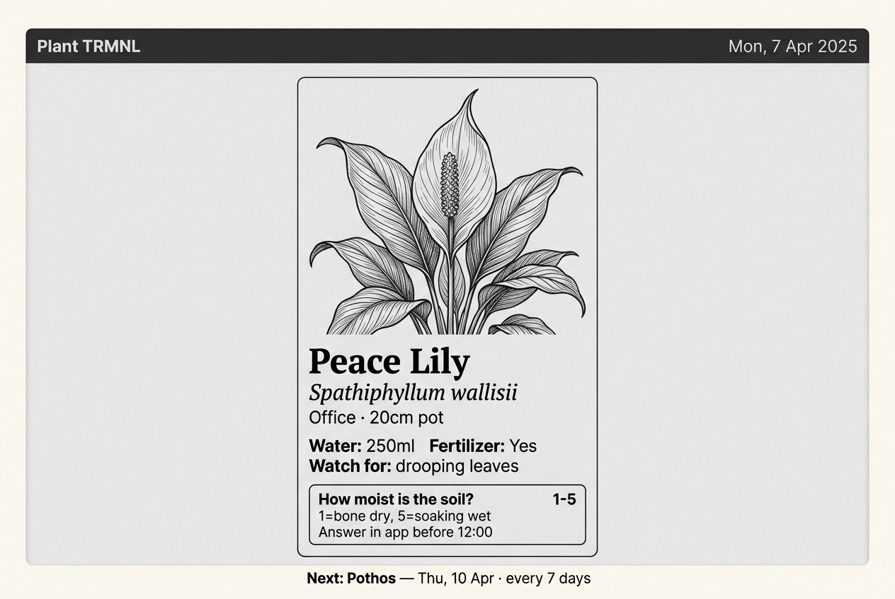

# 🪴 PLNT — plant-trmnl

A houseplant care companion for [TRMNL](https://usetrmnl.com/) e-ink displays + a mobile-first web app.

PLNT shows you which plants need water today on your TRMNL screen, learns each plant's actual cadence in YOUR home through quick calibration taps, and surfaces care suggestions when something looks off. It's designed for the 30-second "am I watering today?" check at the kitchen sink — and to look quietly beautiful on your wall the rest of the day.

## Features

- **TRMNL-native daily display** — your watering plan and a rotating plant fact, dithered for e-ink.
- **Mobile-first web app** — log waters one-handed, undo with a 15-second window, calibrate with a 1-5 tap.
- **Adaptive scheduling** — calibration drives interval tweaks; growing-season + heating-season modifiers stack on top.
- **Curated 444-species catalog across 12 categories** — care, light, conditions, 15 facts per species, including 60+ cultivars and variegated variants. Free-text fallback for anything not in the catalog.
- **Bring-your-own-AI enrichment** — plant-trmnl exposes a pull-based API; connect Claude Desktop, ChatGPT scheduled tasks, Cursor, n8n, Ollama, or anything else. No API keys, no metered billing.
- **Self-hosted** — Docker Compose, SQLite, two containers, runs on a Pi.

## Installation

See [INSTALL.md](INSTALL.md). It walks you from `git clone` to a running TRMNL screen in ~10 minutes.

## Documentation

- [`INSTALL.md`](INSTALL.md) — install + AI tool setup recipes
- [`CHANGELOG.md`](CHANGELOG.md) — what shipped when
- [`ROADMAP.md`](ROADMAP.md) — forward plan (Waves 14–16, then v1.0 release)
- [`docs/HANDOFF.md`](docs/HANDOFF.md) — current snapshot for new contributors / sessions
- [`docs/RELEASE-PROCESS.md`](docs/RELEASE-PROCESS.md) — maintainer playbook
- [`docs/specs/`](docs/specs/) — design specs (current)
- [`docs/plans/`](docs/plans/) — implementation plans (current wave)
- [`docs/archive/`](docs/archive/) — historical waves (1–8) for reference

## License

MIT. (See LICENSE.)

## Contributing

Issues and PRs welcome. The project follows a "wave"-based development cadence — each wave bundles 5-15 related issues, ships under one squash-merge PR, and gets a CHANGELOG entry. See `docs/plans/` for past waves.
