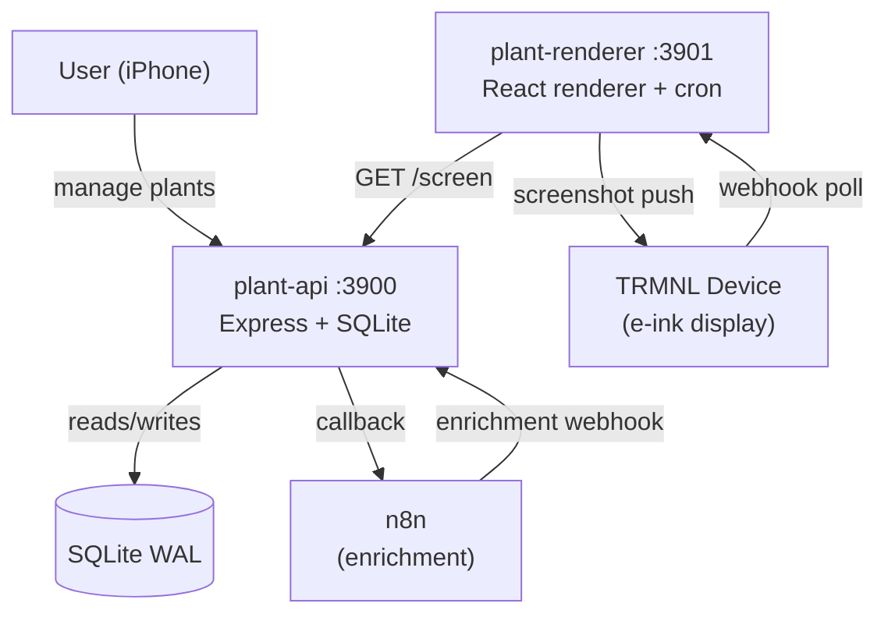

# Plant TRMNL

Plant care management with a TRMNL e-ink display and mobile-first web app.

## Overview

Plant TRMNL combines a self-calibrating watering scheduler with an e-ink daily digest and a mobile web app for quick check-ins. It tracks plant conditions, rotates botanical facts, generates Ghibli-inspired line art via n8n + Claude, and handles vacation mode with smart rescheduling. Two Docker containers serve the API and renderer; n8n handles asynchronous plant enrichment in the background.

## Architecture



The renderer has no direct database access — it only talks to the API over the internal Docker network.

## Features

- **Self-calibrating watering schedules** — learns from daily check-ins; adjusts frequency up or down based on observation history
- **Botanical line art illustrations** — Ghibli-inspired per-plant illustrations generated via n8n + Claude
- **Plant fact rotation** — 150+ curated facts served in non-repeating order
- **Condition tracking** — observation-driven detection (overwatering, underwatering, rootbound, pests, light stress)
- **Vacation mode** — pauses schedules and reschedules intelligently on return
- **Mobile-first management UI** — optimised for iPhone 15 Pro; single-handed watering log in two taps

## Tech Stack

| Layer | Technology |
|---|---|
| Runtime | Node.js 22+ + TypeScript |
| API | Express 5, better-sqlite3 (WAL mode) |
| Frontend | React 19 + Vite |
| Infra | Docker Compose (OrbStack recommended) |
| Display | TRMNL webhook API (Developer Edition) |
| Enrichment | n8n + Claude (plant illustrations + facts) |

## Prerequisites

- Node.js 22+
- Docker + Docker Compose ([OrbStack](https://orbstack.dev) recommended on macOS)
- An [n8n](https://n8n.io) instance with the plant enrichment workflow imported
- A [TRMNL](https://usetrmnl.com) device with Developer Edition enabled

## Quick Start

```bash
git clone <repo-url>
cd plant-trmnl
cp .env.example .env
# Edit .env — set TRMNL_API_KEY, TRMNL_PLUGIN_UUID, N8N_ENRICHMENT_WEBHOOK_URL
docker compose up --build -d
```

- Web app: http://localhost:3900
- TRMNL preview: http://localhost:3901/preview

## Development

```bash
npm install

npm run dev:api        # API server on :3900
npm run dev:renderer   # Renderer server on :3901

# React dev server (hot reload)
cd packages/api/client && npm run dev   # Vite on :5173

# Tests
npm test               # All packages
npm run test:api       # API only
npm run test:renderer  # Renderer only
```

Tests use [vitest](https://vitest.dev). TDD is the default workflow — tests are written before implementation.

## TRMNL Device Setup

Point your TRMNL Developer Edition plugin to `http://<your-host>:3901/trmnl`. The renderer pre-renders a screenshot on a nightly cron (`RENDER_CRON`, default `0 5 * * *`) and serves it as a static image. Full setup details are in [`docs/specs/2026-04-07-plant-trmnl-design.md`](docs/specs/2026-04-07-plant-trmnl-design.md).

## Project Structure

```
plant-trmnl/
├── packages/
│   ├── api/                  # Express API + SQLite + business logic
│   │   ├── src/
│   │   │   ├── database/     # Schema, migrations
│   │   │   ├── routes/       # REST endpoints (plants, calibration, screen, facts, vacation)
│   │   │   ├── scheduling/   # Watering engine, calibration, vacation logic
│   │   │   ├── enrichment/   # n8n webhook handling
│   │   │   ├── config.ts
│   │   │   └── index.ts
│   │   └── client/           # React 19 + Vite web app
│   └── renderer/             # TRMNL renderer + screenshot cron
│       └── src/
│           ├── render/       # React screen component, cache, push
│           ├── cron.ts       # Nightly render + TRMNL push
│           └── index.ts
├── docs/
│   ├── specs/                # Design specifications
│   ├── plans/                # Implementation plans
│   └── mockups/              # Screen design references (4 PNG mockups)
├── assets/                   # Plant illustrations (served read-only)
├── .agents/                  # GOTCHA framework agent configs
├── .env.example
├── docker-compose.yml
└── package.json              # npm workspaces root
```

## Screen Designs

Four TRMNL screen mockups live in [`docs/mockups/`](docs/mockups/):

| File | Description |
|---|---|
| `watering-1-plant.png` | Single plant due today |
| `watering-2-plants.png` | Multiple plants due today |
| `rest-day.png` | No plants due — rest day view |
| `rest-day-overdue.png` | Rest day with an overdue plant flagged |

## Frameworks

This project follows the frameworks Emiel uses across all projects:

- **GOTCHA** — 6-layer agentic architecture (`.agents/`)
- **ATLAS** — Architect-Trace-Link-Assemble-Stress-test (used during planning)
- **GROOM** — Gather-Review-Overlay-Opine-Make changes (used during iteration)
- **FINE** — Fail gracefully, Inform, Never crash silently, Expect the unexpected (error handling)
- **ORBIT** — Observe-Rig-Build-Instrument-Test (SRE/operational practices)
- **12-Factor App** — Config via env, stateless processes, explicit dependencies

## License

Private.
